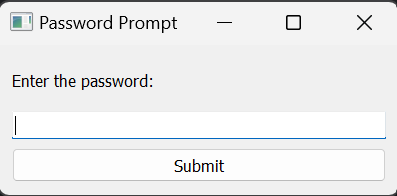

# Password Prompt Application

The Password Prompt Application is a simple desktop application built using PyQt5. It provides a secure way to prompt users to enter a password, and upon successful authentication, it opens the Google Chrome browser to a specified URL.


## CLICK ON FORK THIS REPO

[](https://github.com/HacktiveMindset/Password-Prompt-App/fork)

## Features

- User-friendly password prompt.
- Secure password validation.
- Automatic opening of Google Chrome to a predefined URL.

## Getting Started

### Prerequisites

- Python 3.11
- PyQt5 library

### Installation

1. Clone the repository:
   ```bash
   git clone https://github.com/HacktiveMindset/Password-Prompt-App.git
   ```
   Install PyQt5:
   ```bash
   pip install PyQt5
   ```
### Usage

1. Run the application:
   ```bash
   python password_prompt_app.py
   ```
2. You will be prompted to enter a password. Upon successful authentication, the Google Chrome browser will open to the specified URL.
  
### Configuration

You can customize the correct password and the URL by modifying the password_prompt_app.py file.
```bash
   # Define your correct password
correct_password = "your_password"

# Define the URL to open in the browser
browser_url = "https://example.com"

   ```
# License

Password Prompt Application is licensed under the MIT [LICENSE](https://github.com/HacktiveMindset/Password-Prompt-App/blob/main/LICENSE)

# Contact

For inquiries or feedback, please contact

[](https://www.instagram.com/piyush.mujmule)
